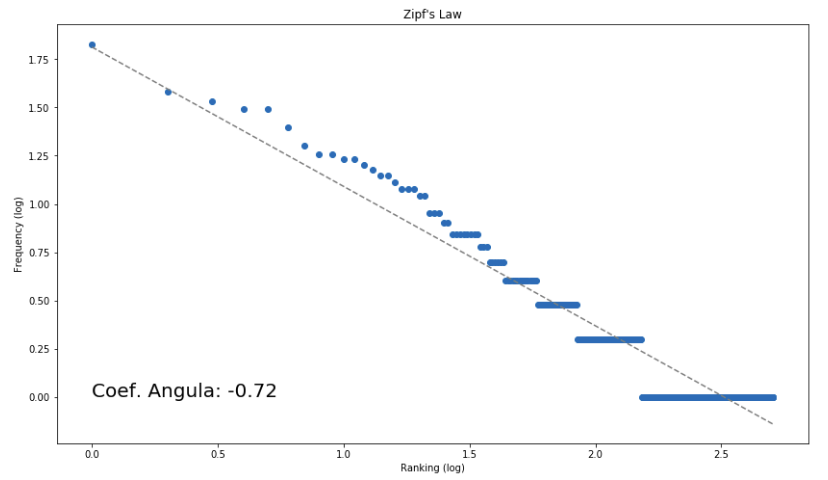

# Text Filtering

A very simple example of dealing with text input.
   
This code is concerned about importing a text (.txt) file, breaking the text into words inside a list, and then creating a new list by excluding certain words.
  
After that we use the 'Counter' library to count the most commom words in our list.

## How does it look like?

## Dependencies
collections  
math  
matplotlib  
numpy
